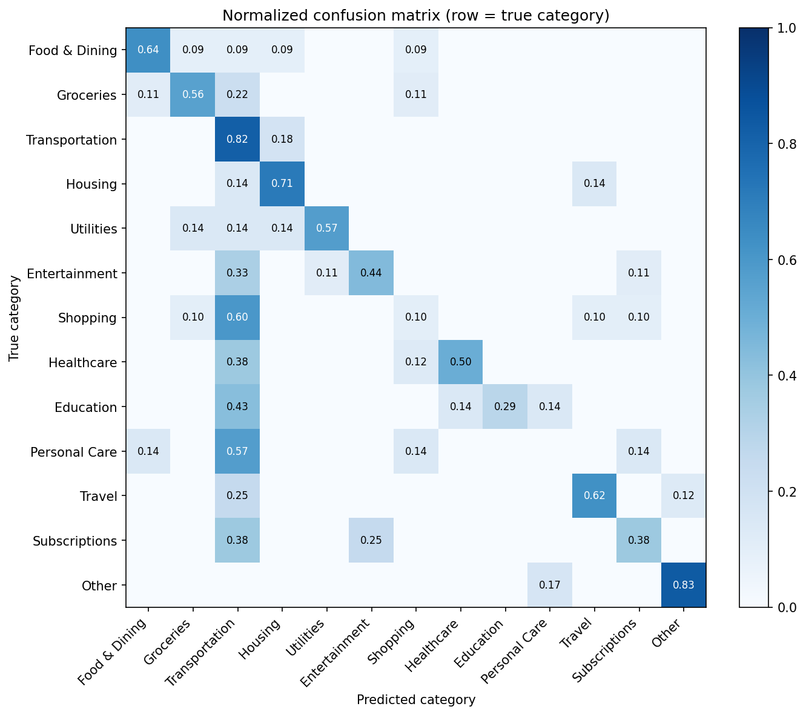
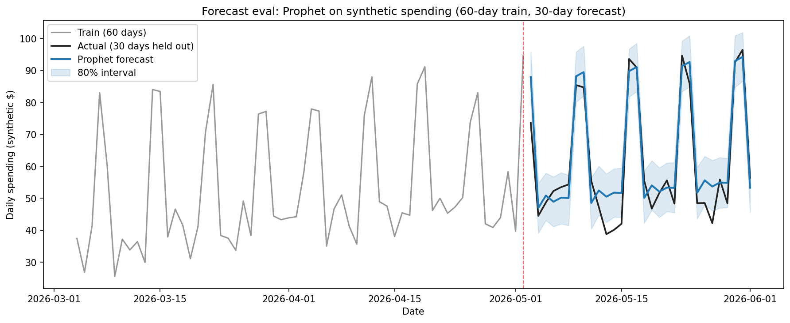

# SpendSmart — Evaluation

Methodology and full results for the two ML components in SpendSmart: the expense categorization classifier and the Prophet spending forecaster. The README contains the headline numbers; this document is the deep dive.

## 1. Categorization model

### Setup

The classifier is a scikit-learn `Pipeline` of `TfidfVectorizer` (`ngram_range=(1, 2)`, `max_features=5000`, English stop words) followed by `MultinomialNB(alpha=0.1)`. Training data is 539 hand-curated `(description, category)` examples across 13 categories, defined in `apps/api/app/ml/training_data.py`.

- **Train/test split:** 80/20 stratified, `random_state=42` → 431 train / 108 test.
- **Stratified** so every category retains its proportional share in both sets — otherwise small classes (Education, Personal Care, Other) could land entirely in train or entirely in test by chance.
- **Random state** is fixed so the eval is reproducible: rerunning the script will produce the same numbers.

The eval script (`apps/api/scripts/eval_categorization.py`) mirrors the production training in `app/ml/categorization.py` exactly — same pipeline configuration, same split, same seed. The reported metrics describe the production model, not a separately tuned one.

### Class distribution

| Category | Examples | Share |
|---|---:|---:|
| Transportation | 55 | 10.2% |
| Food & Dining | 54 | 10.0% |
| Shopping | 50 | 9.3% |
| Groceries | 45 | 8.3% |
| Entertainment | 43 | 8.0% |
| Travel | 40 | 7.4% |
| Subscriptions | 40 | 7.4% |
| Healthcare | 39 | 7.2% |
| Housing | 38 | 7.1% |
| Utilities | 35 | 6.5% |
| Education | 35 | 6.5% |
| Personal Care | 35 | 6.5% |
| Other | 30 | 5.6% |
| **Total** | **539** | |

Roughly balanced — top class is 1.8× the smallest. Not a class-imbalance pathology, but the smaller classes have only ~7 test examples each, so per-class numbers should be read with the support count in mind.

### Headline metrics

- **Accuracy:** 50.0% (54 / 108)
- **Macro-avg F1:** 0.51
- **Weighted-avg F1:** 0.50
- **Random baseline:** ~7.7% (13 classes), so the model is well above chance but not deployable as a fully autonomous categorizer — it should be paired with user confirmation in the UI.

### Per-class breakdown

| Category | Precision | Recall | F1 | Support |
|---|---:|---:|---:|---:|
| Food & Dining | 0.78 | 0.64 | 0.70 | 11 |
| Groceries | 0.62 | 0.56 | 0.59 | 9 |
| Transportation | 0.24 | 0.82 | 0.37 | 11 |
| Housing | 0.56 | 0.71 | 0.62 | 7 |
| Utilities | 0.80 | 0.57 | 0.67 | 7 |
| Entertainment | 0.67 | 0.44 | 0.53 | 9 |
| Shopping | 0.20 | 0.10 | 0.13 | 10 |
| Healthcare | 0.80 | 0.50 | 0.62 | 8 |
| Education | 1.00 | 0.29 | 0.44 | 7 |
| Personal Care | 0.00 | 0.00 | 0.00 | 7 |
| Travel | 0.71 | 0.62 | 0.67 | 8 |
| Subscriptions | 0.50 | 0.38 | 0.43 | 8 |
| Other | 0.83 | 0.83 | 0.83 | 6 |

### Confusion matrix



Rows are normalized — each row is the *recall* breakdown for that true class. A perfect model is a solid diagonal.

### Failure-mode analysis

Three structural patterns are visible in the confusion matrix:

1. **Transportation is a fallback column.** The Transportation column is the darkest non-diagonal cell for five other classes: Shopping (0.60), Personal Care (0.57), Education (0.43), Healthcare and Subscriptions (0.38 each). Combined with Transportation's high recall (0.82) and low precision (0.24), this is a low-confidence-default pattern: when the input doesn't contain training-vocabulary tokens for any class, the model leans on Transportation. Class distribution isn't dramatically tilted in Transportation's favor (it's 10.2% of training), so the cause is vocabulary overlap rather than prior dominance — Transportation training descriptions include broad words like "monthly", "pass", "fee" that show up across other categories.
2. **Personal Care collapses to 0% F1.** Every true Personal Care test example gets pulled into a neighbor — Transportation (0.57), Food & Dining (0.14), Shopping (0.14), Subscriptions (0.14). The Personal Care training set leans on words ("shampoo", "salon", "haircut") that are mostly absent from the held-out 7 examples, and the words that *are* present overlap with Healthcare and Shopping.
3. **Education has perfect precision (1.0) but only 0.29 recall.** When the model *does* commit to Education, it's correct — but it almost never commits. The 5 of 7 misses get pulled into Transportation, Personal Care, and Subscriptions. Education examples that contain words like "online", "course", or "tuition" are sparse, and many examples (e.g. "textbook", "lab fee") get bigram-matched against unrelated classes.

Categories with high F1 (Other 0.83, Food & Dining 0.70, Utilities 0.67, Travel 0.67, Housing 0.62) all have **distinctive non-overlapping vocabulary**: Other is residual catch-all, Utilities has electric/water/internet, Housing has rent/mortgage/HOA, Travel has flight/hotel/airline. The classifier rewards distinctiveness directly because TF-IDF *is* a distinctiveness score.

### Edge-case test set

A separate hand-curated 29-example set in `apps/api/scripts/edge_cases.py` deliberately targets known failure modes. None of these descriptions appear in the training set.

- **Edge-case accuracy: 21 / 29 = 72.4%**

The accuracy is higher than the 50% on the held-out split because the edge-case set includes some no-brainers ("Rent" → Housing, "Tuition" → Education) that the model handles confidently. The 8 misses are more informative than the aggregate number:

| # | Description | Expected | Predicted | Confidence | Failure mode |
|---:|---|---|---|---:|---|
| 4 | `Costco` | Groceries | Transportation | 0.27 | Bare merchant with no category-strong tokens → low-confidence fallback |
| 8 | `Uber Eats` | Food & Dining | Transportation | 0.54 | "Uber" bigram dominates the score; the model can't override a strong unigram with a single modifier |
| 10 | `Amazon Prime` | Subscriptions | Shopping | 0.48 | "Amazon" pulls toward Shopping; "Prime" alone isn't a strong Subscriptions signal |
| 13 | `Netflix gift card` | Shopping | Other | 0.20 | Both tokens signal different things weakly; model abstains into Other |
| 15 | `YouTube Premium` | Subscriptions | Entertainment | 0.64 | Reasonable confusion — "Premium" is weak, YouTube/Entertainment training overlap is strong. Arguably the prediction is defensible. |
| 17 | `Walgreens shampoo` | Personal Care | Healthcare | 0.21 | Tied with Personal Care at 0.20 — a 0.01 margin. Effectively a coin flip. |
| 24 | `H Mart` | Groceries | Transportation | 0.10 | OOV merchant; bottom-prior fallback |
| 25 | `Erewhon` | Groceries | Transportation | 0.10 | OOV merchant; same pattern |

The confidence column matters: every miss except YouTube Premium has confidence ≤ 0.54, and four are at 0.27 or lower. A **0.40 abstain threshold** would have surfaced 6 of the 8 misses as "uncertain" for user review in the UI rather than silently mis-categorizing them.

### Concrete next steps

Based directly on what the eval surfaced, in priority order:

1. **Confidence-threshold the predictions.** Below ~0.40, return "Other" (or surface a UI affordance) instead of committing to the top-1 class. Cheap, immediately raises perceived quality.
2. **Add character n-grams to the vectorizer** (`analyzer='char_wb', ngram_range=(3, 5)`). Would help OOV merchants like "H Mart" and "Erewhon" by matching on substring patterns instead of whole tokens.
3. **Grow the training set for Personal Care, Shopping, and Subscriptions** — the three weakest classes. Targeting 60–80 examples each (vs. current 35–50) would address the F1 collapse for Personal Care.
4. **Use the user-confirmation flow as a feedback loop.** The `retrain()` hook in `app/ml/categorization.py:178` already accepts new `(description, category)` pairs; wire the UI's "fix this category" action into it to grow training data organically.

---

## 2. Spending forecaster

### Setup

The forecaster uses Facebook Prophet with the production configuration from `app/ml/forecasting.py:277`:

- `yearly_seasonality=False` (needs ≥365 days to fit; we use a 90-day window)
- `weekly_seasonality=True` (learn weekday vs. weekend rhythm)
- `daily_seasonality=False`
- `changepoint_prior_scale=0.1` (moderate trend flexibility)

The forecaster requires ≥ 14 non-zero days of history before it will run; otherwise it returns a "not enough data" response (`forecasting.py:253`).

### Eval methodology

`scripts/eval_forecasting.py` does a single-window holdout backtest on synthetic data with known structure:

- **Synthetic series:** 90 days of daily spending. Weekday base ~$35, weekend base ~$75, linear $0.20/day upward trend, N(0, $8) Gaussian noise. Seed `42`.
- **Train window:** first 60 days
- **Test window:** last 30 days
- **Forecast horizon:** 30 days (matches production default)

Synthetic data is the right starting point because it lets us verify the forecasting *machinery* is sane (Prophet learns the seasonality, the intervals are calibrated) without depending on a seeded DB or live user data. A production-grade eval would replay real expense histories through the same harness.

### Results

| Metric | Value | Interpretation |
|---|---:|---|
| Actual mean daily spend | $61.09 | Ground truth over the 30-day test window |
| Predicted mean | $63.56 | Forecast over the same window |
| **MAE** | **$5.05** | About 8% of the daily mean. Day-to-day error stays small. |
| **MAPE** | **9.7%** | Standard time-series threshold for "good" is < 10%. |
| **80% CI coverage** | **83%** | 25 of 30 held-out days fall inside Prophet's stated 80% interval. Well-calibrated (not over-confident). |



The interval coverage is the most important number. Prophet's `yhat_lower` / `yhat_upper` are an 80% prediction interval — meaning "we believe the true value will fall inside this band 80% of the time." If coverage came in at 30%, the model would be over-confident; at 95%, the intervals would be uselessly wide. 83% means the calibration is roughly honest.

### Limitations

- **Synthetic data only.** Real user spending has structure Prophet may handle worse (e.g. paycheck-aligned spikes, irregular bill due dates, holidays). The variable-vs-bills split in `app/ml/forecasting.py:230` is specifically designed for this; the eval doesn't exercise it.
- **Single-window holdout.** A more rigorous eval would be a rolling-origin backtest (re-fit at each point in time, predict forward, slide). Prophet ships a `cross_validation` helper for this; it's a natural next step.
- **No bills overlay tested.** Production forecasts add bills onto their due dates after training on variable spending. The synthetic eval doesn't include bills, so the bills-overlay code path isn't covered here.

### Concrete next steps

1. **Replay real user data.** Once there's a seeded test user with 90+ days of expenses, run the same eval against the actual `forecast_spending()` call path. Compare MAE between synthetic and real.
2. **Rolling-origin CV.** Use Prophet's `cross_validation` with `initial='60 days', period='7 days', horizon='14 days'` to get robustness across multiple cutoffs rather than one.
3. **Per-category forecast eval.** `forecast_by_category()` is in the codebase but unevaluated. Categories with sparse data should fall back gracefully; verify they do.

---

## 3. Reproducing these evals

From the repository root:

```bash
cd apps/api
source venv/bin/activate
pip install -r requirements.txt   # if not already installed

# Categorization eval — accuracy, classification_report, confusion matrix PNG
python scripts/eval_categorization.py

# Edge-case test set
python scripts/run_edge_cases.py

# Forecast eval (synthetic) — MAE, MAPE, CI coverage, plot PNG
python scripts/eval_forecasting.py
```

Outputs:

- `docs/images/confusion_matrix.png` — normalized confusion matrix
- `docs/images/forecast_eval.png` — actuals vs. predicted with 80% interval
- Console: accuracy, per-class report, edge-case results, forecast metrics

All seeds are fixed (`random_state=42` for the split, `RNG_SEED=42` for the synthetic series), so re-running will produce identical numbers.
